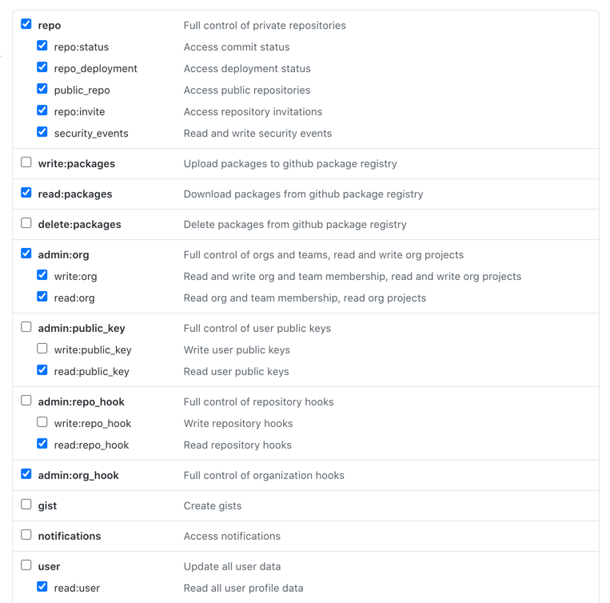

# Github Security Auditor
Audits a Github organization for potential security problems.

## How to run
Set a github token to an environment variable, by default the program 
looks for the environment variable name `GIT_TOKEN` but a different
environment name can be set through the command line argument `--tokenName`.

Then to run just execute the following command. By default the output goes to 
the file `githubsecurity.json`.

`go run . --organization <ORGANIZATION_NAME>` 

### Permissions Needed for Token
In order to run all of the scans the token must have the following permissions.


### Full Usage
```
A tool to collect and highlight potential security issues with a GitHub org. It looks
	at things like:
	* Webhooks
	* User configuration
	* Number of guests
	* Repo and Organization-level settings

Usage:
  githubsecurityauditor [flags]

Flags:
      --config string         config file (default is $HOME/.githubsecurityauditor.yaml)
  -h, --help                  help for githubsecurityauditor
      --organization string   The organization we want to check the security on
      --output string         The file that should have the output recorded to (default "githubsecurity.json")
      --scmUrl string         The API URL for the source control management software you want to check
      --tokenName string      The environment variable name we should retrieve the token for API authentication (default "GIT_TOKEN")
```
### Example Output
```
{
 "TwoFactorAuthEnabled": true,
 "NumberPrivateRepos": 1,
 "NumberPublicRepos": 1,
 "Webhooks": null,
 "ApplicationInstallations": null,
 "ActionRunners": null,
 "Repositories": [
  {
   "Name": "repocrawler",
   "URL": "https://github.com/CodeReconCo/repocrawler",
   "IsPrivate": false,
   "Webhooks": null,
   "HasWiki": false,
   "VulnerabilityAlertsEnabled": true,
   "Workflows": null
  },
  {
   "Name": "githubsecurityauditor",
   "URL": "https://github.com/CodeReconCo/githubsecurityauditor",
   "IsPrivate": true,
   "Webhooks": null,
   "HasWiki": true,
   "VulnerabilityAlertsEnabled": true,
   "Workflows": null
  }
 ]
}
```
